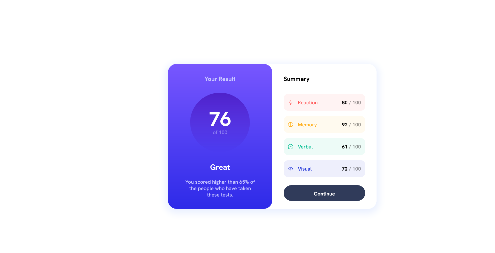
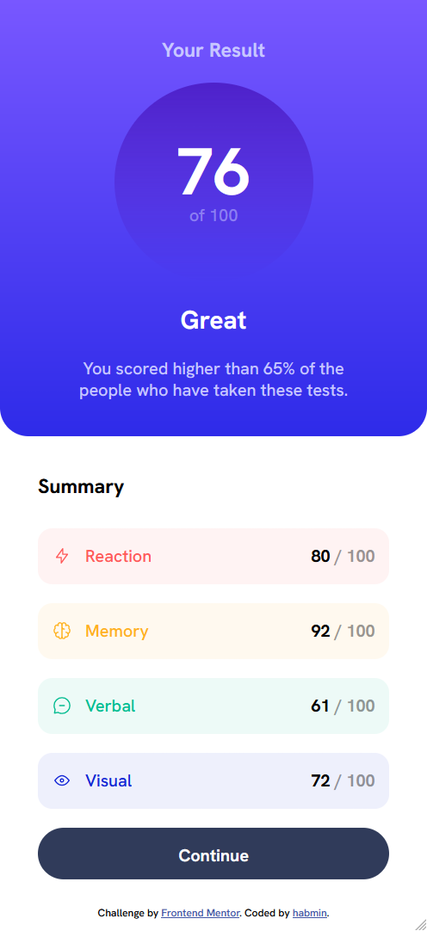

     

*Desktop (left) and Mobile (right) Views*

<h1 align="center">Frontend Mentor - Result Summary Component</h1>

    <h2><a href="https://habmin.github.io/frontend-mentor-results-summary-component/">Live Link</a> | <a href="#">Solution Link</a></h2>

 

## Table of contents

- [Overview](#overview)
  - [Links](#links)
- [My process](#my-process)
  - [Built with](#built-with)
  - [What I learned](#what-i-learned)
  - [Continued development](#continued-development)
- [Author](#author)

## Overview

This is a solution to the [Results summary component on Frontend Mentor](https://www.frontendmentor.io/challenges/results-summary-component-CE_K6s0maV). A basic task of creating a result component that has responsibe mobile views.

### Links

- Solution URL: [Frontend Mentor](#)
- Live Site URL: [GitHub Pages](https://habmin.github.io/frontend-mentor-results-summary-component/)

## My process

Started with structuring the component, putting everything into appripriate containers and tags. Then I worked on the visual styling, such as fonts and colors, shapes and general layout. I did the more refined layout with spacing, padding, and flow for desktop view first. Finally, worked on responsive mobile view. Then added some animation keyframes for fun.

### Built with

- Semantic HTML5 markup
- CSS custom properties
- Flexbox

### What I learned

Became more aquainted with responsive designing, and some flex-box positioning, though still not quite as intuitive as I want it to be. Still, felt more like I was crafting with CSS than fighting with CSS. 

### Continued development

Would love include some JavaScript interaction with this, such as getting the results from the JSON rather than hard-coding it, and implenting animation counters, fill bars, to really liven up the project.

### Author

- Henry Andrew Baum ([habmin](https://github.com/habmin))
